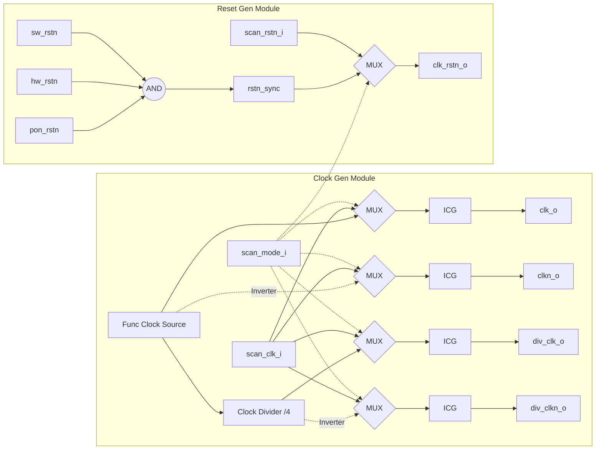
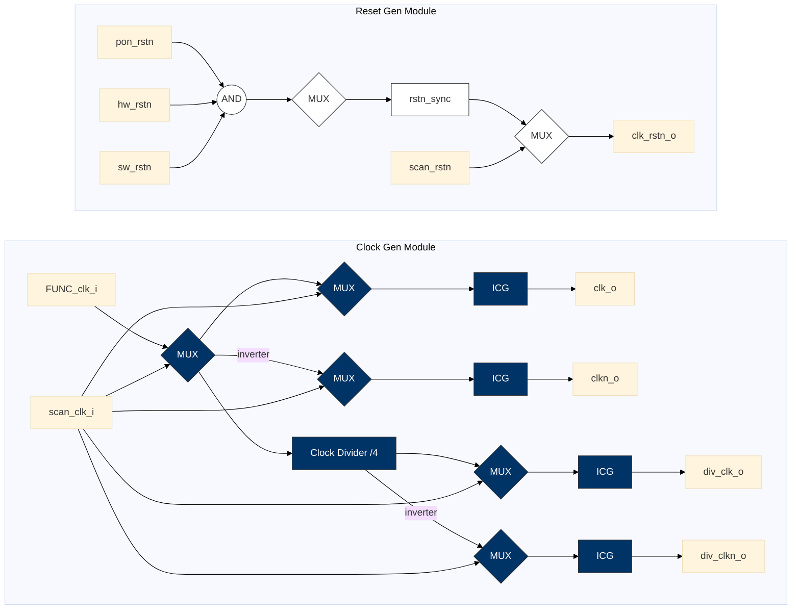

```mermaid
graph LR
    subgraph "Clock Gen Module"
        DIR_CLK[Func Clock Source]
        SCAN_CLK[scan_clk_i]
        SCAN_MODE[scan_mode_i]
        
        DIV[Clock Divider /4]
        
        %% MUX Logic Representation
        MUX1{MUX}
        MUX2{MUX}
        MUX3{MUX}
        MUX4{MUX}
        
        ICG1[ICG]
        ICG2[ICG]
        ICG3[ICG]
        ICG4[ICG]

        DIR_CLK --> DIV
        DIR_CLK --> MUX1
        DIR_CLK -.->|Inverter| MUX2
        
        DIV --> MUX3
        DIV -.->|Inverter| MUX4
        
        %% Scan connections
        SCAN_CLK --> MUX1
        SCAN_CLK --> MUX2
        SCAN_CLK --> MUX3
        SCAN_CLK --> MUX4
        
        %% Controls
        SCAN_MODE -.-> MUX1
        SCAN_MODE -.-> MUX2
        SCAN_MODE -.-> MUX3
        SCAN_MODE -.-> MUX4
        
        %% ICG Connections
        MUX1 --> ICG1 --> OUT1[clk_o]
        MUX2 --> ICG2 --> OUT2[clkn_o]
        MUX3 --> ICG3 --> OUT3[div_clk_o]
        MUX4 --> ICG4 --> OUT4[div_clkn_o]
    end

    subgraph "Reset Gen Module"
        PON[pon_rstn]
        HW[hw_rstn]
        SW[sw_rstn]
        SCAN_RST[scan_rstn_i]
        
        AND((AND))
        SYNC[rstn_sync]
        RST_MUX{MUX}
        
        PON --> AND
        HW --> AND
        SW --> AND
        
        AND --> SYNC
        SYNC --> RST_MUX
        SCAN_RST --> RST_MUX
        
        SCAN_MODE -.-> RST_MUX
        RST_MUX --> RST_OUT[clk_rstn_o]
    end
```

```mermaid
%%{init: {'theme': 'base', 'themeVariables': { 'lineColor': '#000000'}}}%%
graph LR
    %% 設定走線為直角，模擬電路
    linkStyle default routing:orthogonal

    %% 定義樣式：藍色填充、白色文字 (模擬原圖的藍色方塊)
    classDef logic fill:#003366,stroke:#333,stroke-width:1px,color:white;
    classDef plain fill:#fff,stroke:#333,stroke-width:1px;
    
    subgraph "Clock Gen Module"
        direction LR
        %% Inputs
        ScanClk[scan_clk_i]
        FuncClk[FUNC_clk_i]
        
        %% Components
        MuxIn{MUX}:::logic
        Div[Clock Divider /4]:::logic
        
        %% MUX Block
        Mux1{MUX}:::logic
        Mux2{MUX}:::logic
        Mux3{MUX}:::logic
        Mux4{MUX}:::logic
        
        %% ICG Block
        ICG1[ICG]:::logic
        ICG2[ICG]:::logic
        ICG3[ICG]:::logic
        ICG4[ICG]:::logic
        
        %% Wiring
        FuncClk --> MuxIn
        ScanClk --> MuxIn
        MuxIn --> Div
        
        %% Path 1: Normal
        MuxIn --> Mux1
        ScanClk --> Mux1
        Mux1 --> ICG1 --> Out1[clk_o]
        
        %% Path 2: Inverted (用文字標示反向)
        MuxIn -- inverter --> Mux2
        ScanClk --> Mux2
        Mux2 --> ICG2 --> Out2[clkn_o]
        
        %% Path 3: Divided
        Div --> Mux3
        ScanClk --> Mux3
        Mux3 --> ICG3 --> Out3[div_clk_o]
        
        %% Path 4: Divided Inverted
        Div -- inverter --> Mux4
        ScanClk --> Mux4
        Mux4 --> ICG4 --> Out4[div_clkn_o]
    end

    subgraph "Reset Gen Module"
        direction LR
        Pon[pon_rstn]
        Hw[hw_rstn]
        Sw[sw_rstn]
        ScanRst[scan_rstn]
        
        AndGate((AND)):::plain
        RstSync[rstn_sync]:::plain
        MuxRst1{MUX}:::plain
        MuxRst2{MUX}:::plain
        
        Pon & Hw & Sw --> AndGate
        AndGate --> MuxRst1
        MuxRst1 --> RstSync
        RstSync --> MuxRst2
        ScanRst --> MuxRst2
        MuxRst2 --> RstOut[clk_rstn_o]
    end
```