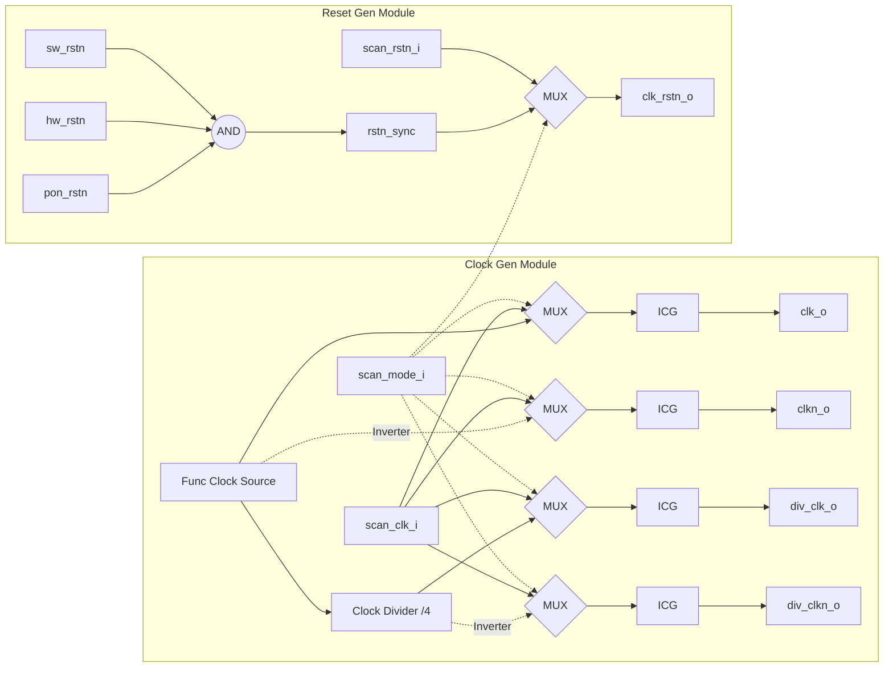

```mermaid
graph LR
    subgraph "Clock Gen Module"
        DIR_CLK[Func Clock Source]
        SCAN_CLK[scan_clk_i]
        SCAN_MODE[scan_mode_i]
        
        DIV[Clock Divider /4]
        
        %% MUX Logic Representation
        MUX1{MUX}
        MUX2{MUX}
        MUX3{MUX}
        MUX4{MUX}
        
        ICG1[ICG]
        ICG2[ICG]
        ICG3[ICG]
        ICG4[ICG]

        DIR_CLK --> DIV
        DIR_CLK --> MUX1
        DIR_CLK -.->|Inverter| MUX2
        
        DIV --> MUX3
        DIV -.->|Inverter| MUX4
        
        %% Scan connections
        SCAN_CLK --> MUX1
        SCAN_CLK --> MUX2
        SCAN_CLK --> MUX3
        SCAN_CLK --> MUX4
        
        %% Controls
        SCAN_MODE -.-> MUX1
        SCAN_MODE -.-> MUX2
        SCAN_MODE -.-> MUX3
        SCAN_MODE -.-> MUX4
        
        %% ICG Connections
        MUX1 --> ICG1 --> OUT1[clk_o]
        MUX2 --> ICG2 --> OUT2[clkn_o]
        MUX3 --> ICG3 --> OUT3[div_clk_o]
        MUX4 --> ICG4 --> OUT4[div_clkn_o]
    end

    subgraph "Reset Gen Module"
        PON[pon_rstn]
        HW[hw_rstn]
        SW[sw_rstn]
        SCAN_RST[scan_rstn_i]
        
        AND((AND))
        SYNC[rstn_sync]
        RST_MUX{MUX}
        
        PON --> AND
        HW --> AND
        SW --> AND
        
        AND --> SYNC
        SYNC --> RST_MUX
        SCAN_RST --> RST_MUX
        
        SCAN_MODE -.-> RST_MUX
        RST_MUX --> RST_OUT[clk_rstn_o]
    end
```