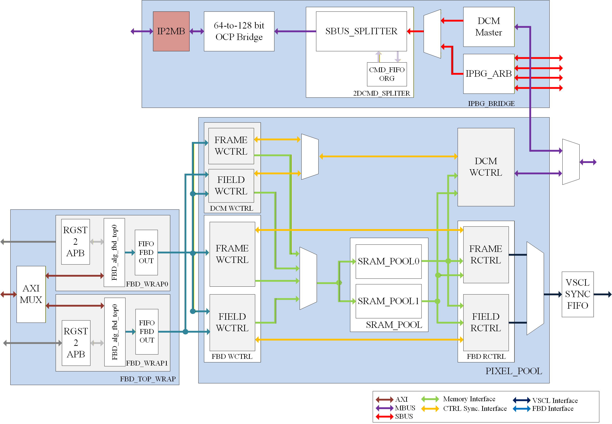
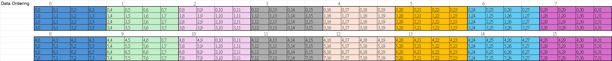
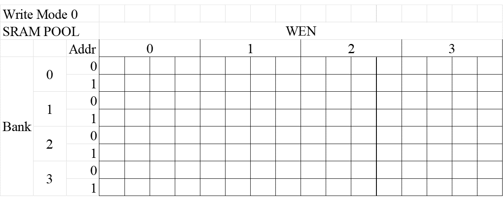

### Brief Introduction for DDFCH Implementation 

This design implementes the integration changes for the **Data Fetching (DDFCH)** module within the **4K Display System**, from DRAM and Frame Buffer Decompression (FBD) IPs.

1. It supports the original 2K path with original path, and FBD path for 4K resolution, which translate the image format to linear to VSCL format (e.g., 4x1 or 4x2 pixel data).
2. The memory pool supports frame and field mode which stores the pre-fetched decompressed Luma/Chroma pixels, which provides a two read/write modes to save memory usage about 50%, compared to traditional ping-pong buffering, and provide faster write response time for writing (by handling a quarter of the data from each of four lines)
3. It provides a Decimation Function (Down Scaling) to write processed pixel data back to DRAM.

Regarding the data flow, a brief example is provided illustrating how the SRAM Pool translates a 4x4 write ordering to a 4x1 read ordering. The following figure uses a 32x8 pixel image, where the 4x4 block write ordering follows a raster scan over 16 cycles.

The following illustrates the two modes used to complete this reordering process. For a 4x1 output, the design utilizes a minimum of four SRAM banks, with each bank having only Address 0 and 1. This brief example demonstrates the control logic for the Address, Bank, and WEN (Write Enable) signals to manage the required data conversion.

