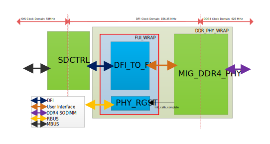

# 1. Introduction `Jerry`

This document presents the design specification for integrating the In-House SDCTRL with the MIG DDR4 PHY IP. The In-House SDCTRL, which supports only DDR2/3 protocols under DFI 2.1, cannot be directly used with the phy interface in MIG DDR4 PHY IP. The design challenges we face are listed below:

* The DFI timing coefficients in the In-House SDCTRL are not compliant with DDR4 specifications.
* The memory mapping of the In-House SDCTRL is incompatible with DDR4.
* The additional commands for DDR4 require further implementation
* DDR4 training and maintenance mechanisms are not supported by the In-House SDCTRL, need to redesign.

This means we nearly to implement a new DDR4 controller, which extreamly increase the design difficulty. Therefore, we've decided to implement a design with the MIG user interface, the properties are between the transactional (i.e., AXI) and physical layer protocols (i.e., PHY interface).

This MIG user interface can resolve DDR4 timing/scheduling issues and provides an FIFO interface, which is more suitable for our design. This design will give a communication bridge between the original `DDR PHY Interface (DFI)` and the `FPGA User Interface (FUI)`. This design addresses the following key features:

# 2. Features `Jerry`

* Provide an interface that translates protocols from DFI to FUI.
* Support a handshaking mechanism for read/write commands in FUI, communicating with DFI.
* Solve the mapping problem from DFI 2.1 to DDR4.
* Register read for calibration done from the PHY.
* Precharge, refresh command, and ZQ command already implemented in MIG IP core, no need to design.
* Operating frequency runs at 156.25MHz to meet the minimum DDR4 frequency requirement (625MHz, 1:4 ratio) in MIG rules.

# 3. System Overview `Jerry`

The following figure presents the block diagram. The various arrows represent the different protocols that communicate between modules. The FUI_WARP, marked by a red rectangle, is the primary design connecting the In-House SDCTRL to the MIG_DDR4_PHY. The FUI_WRAP translates DFI signals to FUI signals, and communicates with the DDR4 SO-DIMM to enable successful memory access for the SDCTRL.

The FUI_WRAP involves two modules:

* DFI_TO_FUI: This is the main module to translates the protocols for the MIG_DDR4_PHY with user interface.
* PHY_RGST: This module reports the status of the calibration 'done' signal from the PHY, informing the CPU when it can boot from DRAM.

More detailed descriptions are provided in the next section.



# 4. Functional Discription

## 4.1 DFI_TO_FUI `Max`

`To Max: Because this is the main module, you may draw an diagram and add more discription to exaplain what you want to design`

[Design_Spec_DFI_TO_FUI](https://gitlab.availink.com/chips/product-management-4k-restarting/fpga-development/-/wikis/Design_Spec_DFI_TO_FUI)

## 4.2 PHY_RGST `Jerry`

This register file is for reading calibration done for CPU. Main CPU can polling this register to give the phy ready signals to start transmit data. The register setting is listed in below section.

## 4.3 MIG_DDR4_PHY `Jerry`

This module is generated by MIG with DDR4 PHY only module. which gave a phy design with FUI for customer controller integration. The following table lists the feature for generating the information

| Category | Parameter | Value/Selection |
|----------|-----------|-----------------|
| **Interface Mode** | User Interface | app\_\* signals |
| **Clocking** | DDR4 | 625 MHz |
|  | User Interface Clock (`ui_clk`) | 156.25 MHz (625 MHz / 4) |
| **Memory Options** | Memory Type | DDR4 SODIMM |
|  | Memory Part | MTA16ATF2G64HZ-2G3 |
|  | Memory Details | 16GB, 2 Ranks, 64-bit, 1.2V |
|  | Cas Latency (CL) | 10 |
|  | Cas Write Latency (CWL) | 9 |
|  | Burst Length | 8 (Fixed) |
| **Controller Options** | ECC | Disabled |

Performance data can be referenced directly from the User Interface evaluation in the document.

* **Read Latency**:
  * According to PG150 **Page 22, Table 2: User Interface Idle Latency**, under ideal idle conditions, the latency for your User Interface will be:
    * **Page Hit (Directly Read/Write)**: \~72 tCK (DRAM clock cycles)
    * **Closed Page(ACT-\>Read/Write)**: \~92 tCK
    * **Page Miss(PRE-\>ACT-\>Read/Write)**: \~112 tCK

The DFI has to consider the worst case for 112 tCK (28 ui_clk).\
All necessary DRAM maintenance tasks will be handled automatically by the MIG IP core, we do not have to manage these operations.

* **Refresh**: The controller will automatically insert Refresh commands in the background to meet the `tREFI` requirement.
* **ZQ Calibration**: The controller will automatically handle periodic `ZQCS` commands.
* **VT Tracking**: When required (e.g., during long write streams), the controller will automatically inject periodic reads to the PHY.

Please refer to PG150 for more details

# 5. Signal Definition

## 5.1 In-House SDCTRL DDR PHY Interface `Max`

<details>
<summary>Click to expand</summary>

* DFI Port (Address/Control)

| Signal  | I/O | Description |
|---------|-----|-------------|
| DFI_ADDRESS_P0\[15:0\] | Output | Address bus from memory controller to PHY for Phase 0. Specifies the memory location for read/write operations. |
| DFI_BANK_P0\[2:0\] | Output | Bank address bus for Phase 0. Selects the target bank within a DRAM device. |
| DFI_RAS_N_P0\[0:0\] | Output | Row Address Strobe (active low) for Phase 0. Initiates a row access. |
| DFI_CAS_N_P0\[0:0\] | Output | Column Address Strobe (active low) for Phase 0. Initiates a column access. |
| DFI_WE_N_P0\[0:0\] | Output | Write Enable (active low) for Phase 0. Controls write operations. |
| DFI_CS_N_P0\[0:0\] | Output | Chip Select (active low) for Phase 0. Selects a specific DRAM chip or rank. (Note: Comment suggests width tied to chip num, but current definition is 1 bit). |
| DFI_ODT_P0\[0:0\] | Output | On-Die Termination Enable for Phase 0. Controls internal termination resistors on DRAM devices.. |
| DFI_ADDRESS_P1\[15:0\] | Output | Address bus from memory controller to PHY for Phase 1. |
| DFI_BANK_P1\[2:0\] | Output | Bank address bus for Phase 1. |
| DFI_RAS_N_P1\[0:0\] | Output | Row Address Strobe (active low) for Phase 1. |
| DFI_CAS_N_P1\[0:0\] | Output | Column Address Strobe (active low) for Phase 1. |
| DFI_WE_N_P1\[0:0\] | Output | Write Enable (active low) for Phase 1. |
| DFI_CS_N_P1\[0:0\] | Output | Chip Select (active low) for Phase 1. |
| DFI_ODT_P1\[0:0\] | Output | On-Die Termination Enable for Phase 1. |


* Write Data Interface

| Signal Name  | I/O | Description |
|--------------|-----|-------------|
| DFI_WRDATA_P0\[31:0\]  | Output | Write Data bus for Phase 0. Data transmitted from controller to PHY for writing to memory. |
| DFI_WRDATA_EN_P0\[1:0\] | Output | Write Data Enable for Phase 0. Indicates when write data is valid. |
| DFI_WRDATA_MASK_P0\[3:0\] | Output | Write Data Mask for Phase 0. Allows byte-level write masking. Active high: high to mask write data. |
| DFI_WRDATA_P1\[31:0\] | Output | Write Data bus for Phase 1. |
| DFI_WRDATA_EN_P1\[1:0\]  | Output | Write Data Enable for Phase 1. |
| DFI_WRDATA_MASK_P1\[3:0\] | Output | Write Data Mask for Phase 1. |


* Read Data Interface

| Signal Name  | I/O | Description |
|--------------|-----|-------------|
| DFI_RDDATA_W0\[31:0\]  | Input | Read Data bus for Window 0. Data transmitted from PHY to controller after a read operation. |
| DFI_RDDATA_VALID_W0\[1:0\] | Input | Read Data Valid for Window 0. Indicates when read data is valid. |
| DFI_RDDATA_W1\[31:0\] | Input | Read Data bus for Window 1. |
| DFI_RDDATA_VALID_W1\[1:0\] | Input | Read Data Valid for Window 1. |


* Status Interface

| Signal Name  | I/O | Description |
|--------------|-----|-------------|
| DFI_INIT_START\[0:0\] | Output | Memory controller requests the PHY to start the DRAM initialization sequence. |
| DFI_INIT_COMPLETE\[0:0\] | Input | PHY signals to the memory controller that the DRAM initialization sequence is complete. |
| DFI_DATA_BYTE_DISABLE\[1:0\] | Output | Controller signal to disable specific data bytes for calibration or power-saving. |
| DFI_DRAM_CLK_DISABLE\[0:0\] | Output | Controller requests the PHY to disable the DRAM clock. Often used for power-saving modes. |
| DFI_FREQ_RATIO\[1:0\] | Output | Controller specifies the frequency ratio between the DFI clock and the DRAM clock (e.g., 1:1, 1:2, 1:4). |


* Update Interface

| Signal Name  | I/O | Description |
|--------------|-----|-------------|
| DFI_CTRLUPD_REQ\[0:0\] | Output | Memory controller requests the PHY to perform a controller-initiated update (e.g., for re-training or calibration). |
| DFI_CTRLUPD_ACK\[0:0\] | Input | PHY acknowledges the controller's update request. |
| DFI_PHYUPD_REQ\[0:0\] | Input | PHY requests the memory controller to perform a PHY-initiated update. |
| DFI_PHYUPD_TYPE\[1:0\] | Input | Specifies the type of update requested by the PHY. |
| DFI_PHYUPD_ACK\[0:0\] | Output | Memory controller acknowledges the PHY's update request. |


* Low Power Interface

| Signal Name  | I/O | Description |
|--------------|-----|-------------|
| DFI_LP_REQ\[0:0\] | Output | Memory controller requests the PHY to enter a low-power state. (Comment: "Low power opportunity request"). |
| DFI_LP_WAKEUP\[3:0\] | Output | Memory controller specifies the required wakeup time from the low-power state to the PHY. (Comment: "Low power wakeup time"). |
| DFI_LP_ACK\[0:0\] | Input | PHY acknowledges the controller's low-power request. (Comment: "Low power ack"). |


```
                                          |
```

</details>

## 5.2 FPGA User Interface `Jerry`

<details>
<summary>Click to expand</summary>

| Signal | I/O | Description |
|--------|-----|-------------|
| `app_addr[30:0]` | I | This input indicates the address for the current request. |
| `app_cmd[2:0]` | I | This input selects the command for the current request. |
| `app_en` | I | This is the active-High strobe for the `app_addr[]`, `app_cmd[2:0]`, and `app_hi_pri` inputs. |
| `app_rdy` | O | This output indicates that the user interface is ready to accept commands. If the signal is deasserted when `app_en` is enabled, the current `app_cmd`, `app_autoprecharge`, and `app_addr` must be retried until `app_rdy` is asserted. |
| `app_hi_pri` | I | This input is reserved and should be tied to 0. |
| `app_rd_data[511:0]` | O | This provides the output data from read commands. |
| `app_rd_data_end` | O | This active-High output indicates that the current clock cycle is the last cycle of output data on `app_rd_data[]`. |
| `app_rd_data_valid` | O | This active-High output indicates that `app_rd_data[]` is valid. |
| `app_wdf_data[511:0]` | I | This provides the data for write commands. |
| `app_wdf_end` | I | This active-High input indicates that the current clock cycle is the last cycle of input data on `app_wdf_data[]`. |
| `app_wdf_mask[63:0]` | I | This provides the mask for `app_wdf_data[]`.<br>For DDR3 interface, `app_wdf_mask` port appears in the Data Mask enabled option in Vivado IDE.<br>For DDR4 interface, `app_wdf_mask` port appears in the “ECC” Vivado IDE option values of TRUE. For “ECC” Vivado IDE option values of FALSE, the port appears for DM_NO_DBI and DM_DBI_RD. |
| `app_wdf_rdy` | O | This output indicates that the write data FIFO is ready to receive data. Write data is accepted when `app_wdf_rdy` = 1’b1 and `app_wdf_wren` = 1’b1. |
| `app_wdf_wren` | I | This is the active-High strobe for `app_wdf_data[]`. |
| `ui_clk` | O | This user interface clock must be one quarter of the DRAM clock. |
| `init_calib_complete` | O | PHY asserts `init_calib_complete` when calibration is finished. |
| `ui_clk_sync_rst` | O | This is the active-High user interface reset. |
| `dbg_clk` | O | Debug Clock. Do not connect any signals to `dbg_clk` and keep the port open during instantiation. |


* Maintance Signals (Removed)

| Signal | I/O | Description |
|--------|-----|-------------|
| `app_ref_req`² | I | User refresh request. |
| `app_ref_ack`² | O | User refresh request completed. |
| `app_zq_req`² | I | User ZQCS command request. |
| `app_zq_ack`² | O | User ZQCS command request completed. |
| `app_autoprecharge`¹ | I | This input instructs the controller to set the A10 autoprecharge bit on the DRAM CAS command for the current request. |


**Notes:**

1. This port appears when "Enable Precharge Input" option is enabled in the Vivado IDE.
2. These ports appear upon enabling "Enable User Refresh and ZQCS Input" option in the Vivado IDE.
3. `addn_ui_clkout1` and similar clk outputs are locked and stable when `init_calib_complete` is asserted.

</details>

# 6. Registers `Jerry`

Group 247.0

| Field Name | Bit | Access | Description |
|------------|-----|--------|-------------|
| FPGA_DDR_CAL_DONE | 0 | RO | Calibration Done from DDR PHY. CPU has to wait this value to 1 |
| Reserved | 31:1 |  |  |

Group 247.1

| Field Name | Bit | Access | Description |
|------------|-----|--------|-------------|
| tphy_wrlat | 4:0 | R/W | PHY Write Latency |
| Reserved | 7:5 |  |  |
| tphy_wrdata | 12:8 | R/W | PHY Write Data |
| Reserved | 15:13 |  |  |
| trddata_en | 20:16 | R/W | Read Data Enable Timing |
| Reserved | 23:21 |  |  |
| tphy_rdlat | 28:24 | R/W | PHY Read Latency |
| Reserved | 31:29 |  |  |

# 7. Verification

The test pattern should verify the following aspects:

* Data confirmation using independent memory mapping.
* Data integrity checking with latency access (Page Hit, Closed Page, Page Miss).
* Performance testing.

The verification will be performed by modifying the example design local simulation . Pattern List: TBD.

# 8. Implementation

The implementation status will be listed here, TBD.

# 9. Design Repository

The finished database will listed here, TBD.

## Appendix

### Design notice Summery from PG150

<details>
<summary>Click to expand</summary>

This document describes how to connect a custom memory controller directly to the Xilinx DDR3/DDR4 **PHY Only** interface, bypassing the standard user or AXI interfaces. Below is a summary of the key points and responsibilities for the designer.

#### Core Concepts & User Responsibilities

The "PHY Only" solution provides direct access to the physical layer (PHY), but it comes with significant responsibilities.

* **No Protocol Handling**: The PHY acts only as a direct pass-through for commands. It **does not perform any DRAM protocol or timing checks**. Your custom memory controller is **100% responsible** for meeting all JEDEC DRAM protocol requirements and timing specifications (e.g., `tRAS`, `tRP`, `tRCD`).
* **Full Control**: You must manage all aspects of DRAM operation, including the initialization sequence (after the PHY is ready), refresh commands, ZQ calibration, and other maintenance tasks.

---

#### Command & Address Interface

This interface is not a simple one-to-one mapping; it utilizes a unique "4-Slot" architecture.

* **4-Slot System**: The PHY operates at 1/4 of the DRAM clock frequency, so it accepts **four DRAM commands per system clock cycle**. These are referred to as Slot 0, 1, 2, and 3.
* **Wide Busses**: The input ports are much wider than the DRAM pins. For every single command/address pin on the DRAM, the PHY provides an 8-bit input port.
* **Bit Mapping**: These 8 bits correspond to the 4 command slots (2 bits per slot). For example, in the 8-bit `mc_ACT_n` port, bits \[1:0\] correspond to Slot 0, bits \[3:2\] correspond to Slot 1, and so on.
* **Driving Rule**: Since the DRAM command bus is single data rate (SDR), you **must drive both bits for a given slot to the same value** (e.g., to assert `ACT_n` in Slot 0, `mc_ACT_n[1:0]` must be set to `2'b00`).
* **CAS Command Limitation**: Read and Write CAS commands can only be placed in specific slots (the even slots, i.e., Slot 0 and 2), not in any arbitrary slot.

---

#### Data Interface

The data path is designed for high throughput based on a fixed burst length.

* **Burst Length 8 (BL8) Only**: The PHY **only supports BL8 data transfers**.
* **Full Burst Transfer**: The data ports (`wrData`, `rdData`) are wide enough to transfer an entire BL8 burst for the whole DQ bus in a **single system clock cycle**.
* **Control Signals**: You must use and respond to the PHY's control signals (like `rdDataEn`, `wrDataEn`) to manage the data flow, as the PHY has no internal data buffering.

---

#### Initialization & Maintenance

Your controller must wait for the PHY to be ready and then take over all maintenance duties.

* **Initialization**: You must wait for the PHY to complete its internal power-up, initialization, and training sequence, which is indicated by the assertion of the `calDone` output signal. **No DRAM commands should be sent before `calDone` is high**.
* **Required Commands**: After `calDone` is asserted, your controller is responsible for issuing all necessary commands, including the periodic commands for **Refresh**, **ZQ Calibration**, and the operations required to support **VT Tracking** (Voltage and Temperature Tracking).

</details>

## Reference

[User_Interface_Introduction](https://gitlab.availink.com/chips/product-management-4k-restarting/fpga-development/-/wikis/User_Interface_Introduction)\
[Vivado_PG150](https://docs.amd.com/viewer/book-attachment/flt3b6Mn8NdXiyvlSsCAgA/7k9FysAWXFALlRYcsCRfJw-flt3b6Mn8NdXiyvlSsCAgA)\
[KVR26S19D8_16](https://www.kingston.com/dataSheets/KVR26S19D8_16.pdf)\
[JEDEC_STANDARD(JESD79-4)](https://e2e.ti.com/cfs-file/__key/communityserver-discussions-components-files/196/JESD79_2D00_4.pdf)