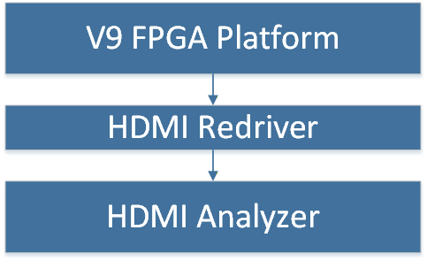
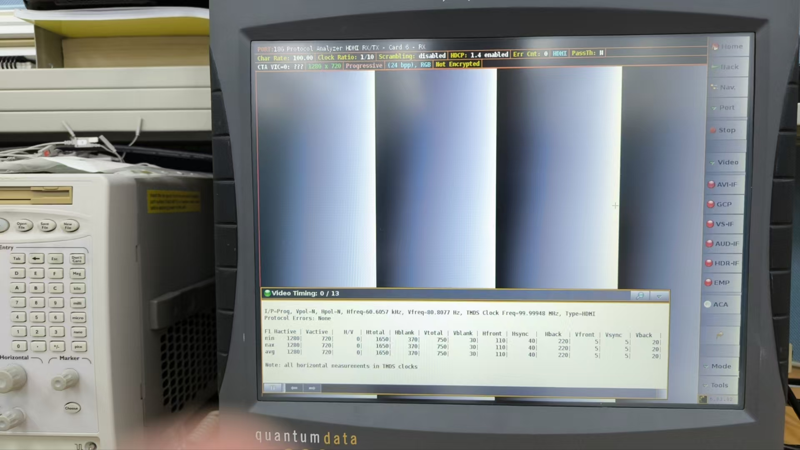

### Responsed Jobs for FPGA

#### DDR Integration jobs

* The entire FPGA project utilizes the [XCVU9P-L2FSGD2104E](https://talentpros.com.tw/tps-8-series-lite) and is implemented using [VIVADO](https://www.xilinx.com/support/download.html). The main reason for porting the 4K system to this new platform was the resource limitation of the original [HAPS-70](https://news.synopsys.com/2013-12-16-Synopsys-Extends-HAPS-70-Prototyping-Family-with-New-Solution-Optimized-for-IP-and-Subsystems) FPGA board, which could not accommodate the verification requirements of the new 4K IC.

##### SERDES integration for In-house DDR3 SDCTRL

* For the new V9 FPGA platform, a separate DDR3 daughter board was designed to verify our in-house SDCTRL. However, the initial testing shows the CPU access failure due to receive uncorrect data. This was determined to be caused by poor signal integrity and imbalanced signaling on the DDR3 interface.

* To resolve this platform issue, we uses SEDRES as our first try version, which can dynamically configures the delays on individual DDR3 pins to ensure data correctness. We desin a register setting to control these SERDES blocks to DDR3's data and control signals. This PHY RTL was designed to handle the 4:1 clock ratio requirement for parallel-to-serial conversion. By controlling the clock phases (90°, 180°, 270°, 360°), the DDR3 PHY was able to fine-tune the timing at the phase level, effectively overcoming the signal integrity problem.

* This custom PHY design allows for fine-grained timing adjustments across all DDR3 interface phases. The implemented design achieved a 108 MHz data rate on the DDR3 interface, the low operating frequency also explain why we donot use IODELAY to implement it. However, further enhancement was limited because the in-house DDR Controller presented a timing bottleneck, prompting considerations for next-generation improvements.

* `Less structure to explain how to implement this design.`

##### MIG DDR4 PHY integration

* The plan was to generate PHY-only IPs and integrate them with the in-house SDCTRL. This approach provided three distinct connection interfaces. Given that the DDR4 interface cannot directly connect to the SDCTRL, the integration focused on establishing the connection via the MIG's [USER interface, PG150](https://docs.amd.com/r/en-US/pg150-ultrascale-memory-ip/User-Interface?tocId=kLdS~zIRXPqmOCWQcjY~7wfrom). The specification can be list [here](). This project was incomplete upon my departure.

#### HDMI Integration Jobs

#### HDMI PHY + In-house HDMI Tx integration

* The original HDMI interface relied on connecting over 30 FPGA IO pins (for three channels and sync signals) to an external [ADV7842/ADV7511 Video Evaluation Board](https://www.analog.com/media/en/technical-documentation/user-guides/UG-235.pdf). This high pin count limited the operating speed to just 27 MHz. This speed was insufficient for verifying resolutions higher than 480P at standard rates, failing to simulate real-world conditions.

* The solution involved modifying the original HDMI ports to connect via the HDMI PHY IP (PG230).

* The project's next phase involved porting the PHY example design and integrating it into the SOC system. IBERT tests were successfully passed. Leveraging the full test environment (including an HDMI Redriver and Analyzer), the final HDMI Tx achieved a significant speed increase to 74.25 MHz, a massive improvement over the initial 27 MHz. This enabled the entire system to run reliably at 74.25 MHz, supporting 720P60/1080P30 resolution. Internal BIST (Built-In Self-Test) patterns from the in-house HDMI Tx confirmed that the image was captured correctly with accurate DTG timing.

* [HDMI Redriver](https://www.ti.com/tool/TDP158RSBEVM)

* [HDMI Analyzer](https://www.teledynelecroy.com/protocolanalyzer/quantumdata980.aspx)

