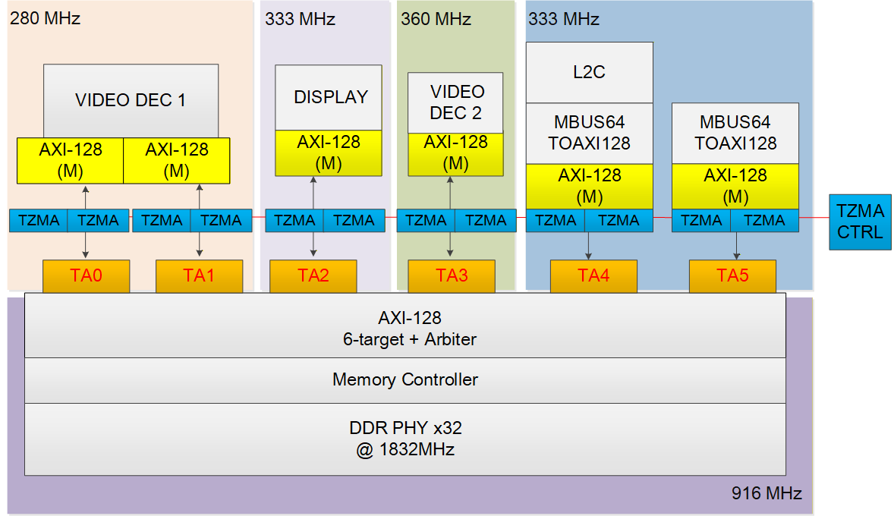
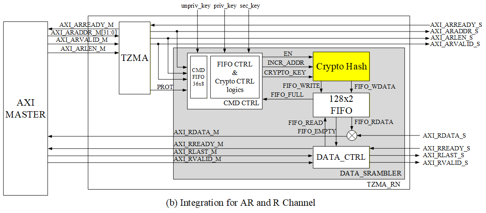
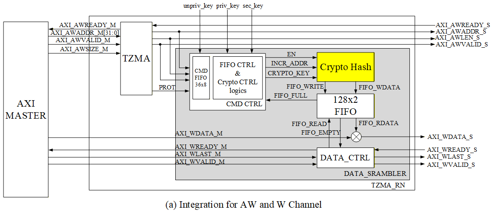

### Brief Introduction for TZMA Design Specification

The following contenst shows the brief introduction for the Trust-Zone Memory Adaptor (TZMA) and Trust-Zone Control ReGiSters (TZCRGS). The  purpose is to implement DRAM data protection with secure/non-secure attributes and control register access security.

***
### Trust-Zone Memory Adaptor (TZMA)

This block diagram provides a detailed system overview of how various clock domains and masters in the SFH980 access DDR memory securely through the Trust-Zone Memory Adaptor (TZMA).

 A TZMA module with Read/Write Channel is integrated in series along the path of every AXI-128 Master port (TA0 to TA5). Each AXI chennels has two modules to reaponse the Read(AR and R) and Write(AW and W) channel, respectively. These TZMA modules checks DRAM access authority based on the master's security attributes (Secure/Non-Secure) and the configured memory regions, and leeds the dataflow to dummy address to prevent the data is accessed by un-authority masters. Furthermore, the TZMA CTRL unit is responsible for centralized status monitoring and management of all TZMA modules, The setting are all controlled by register setting.

These diagrams illustrate how the TZMA module integrates the Crypto Hash (acting as the DATA\_SCRAMBLER) unit to manage data encryption and decryption flows over the AXI interface.

#### AW and W Channel Integration (Write Flow)

In the write flow, when the AXI Master initiates a memory write via the AW (Address Write) channel, the **TZMA** module receives the command. The address and length are latched into the **CMD FIFO (36x8)** for supporting outstanding transmission. Subsequently, the FIFO CTRL & Crypto CTRL logics selects the appropriate key (`unpriv_key`, `priv_key`, or `sec_key`) as generated seed `the CRYPTO_KEY`  based on the `PROT` signal and the memory region configuration, feeding it to the DATA\_SCRAMBLER. The DATA\_SCRAMBLER then encrypts (Scrambles) the AXI Master's write data (`AXI_WDATA_M`) using the selected CRYPTO_KEY. The encrypted data is stored in the 128x2 FIFO. 
Finally, the DATA_CTRL unit coordinates the control signals to output the encrypted data via the `AXI_WDATA_S` port to the DDR Slave.

#### AR and R Channel Integration (Read Flow)

For the read flow, the AXI Master initiates a memory read request via the AR (Address Read) channel. Similarly, the address and data length are stored in the CMD FIFO. The FIFO CTRL & Crypto CTRL logics selects the corresponding CRYPTO_KEY based on the requested region. 
When the encrypted data (`AXI_RDATA_S`) arrives from the DDR (Slave), it enters the Crypto Hash for decryption (De-scrambling). The decrypted data is then stored within the **128x2 FIFO**, so the **DATA_CTRL** unit coordinates the control signals to output the decrypted data (`AXI_RDATA_M`) back to the AXI Master via `AXI_RVALID_M`.

