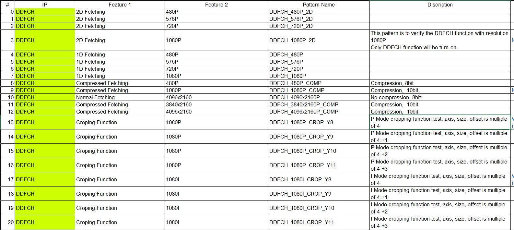
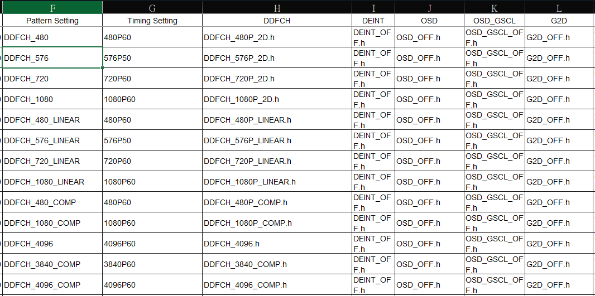
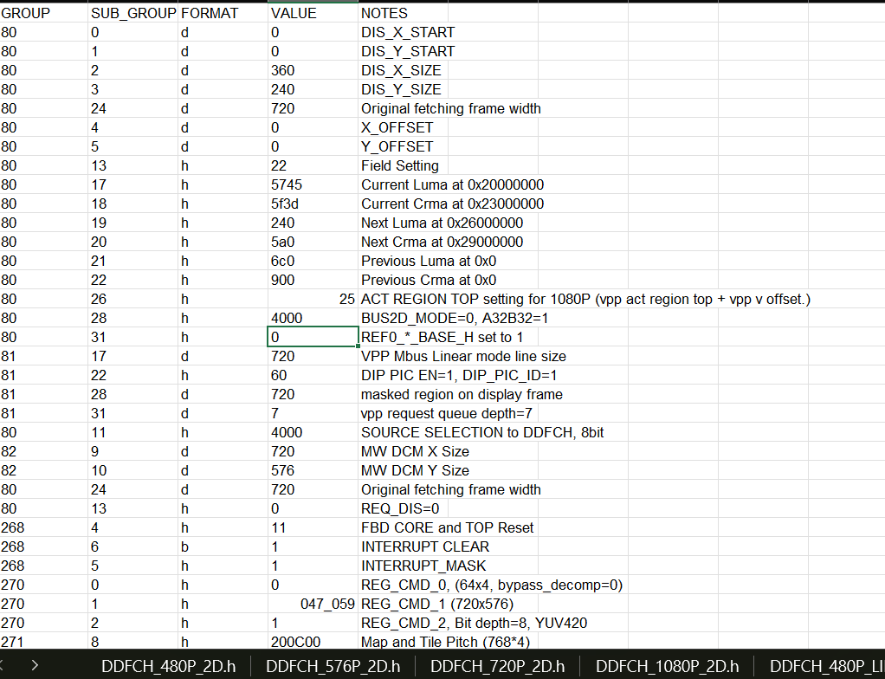

### DISPLAY Verification

* The DISPLAY Verification has a register setting generation script which writen by PERL, the verificaion pattern can be generated by an EXCEL defined table to build it. 

* The first picture shows the pattern list, for example, DDFCH_480P_2D is used to test the 2D fetching (a In-house storing format in DRAM for reduce the precharge command, and enhance the data reading peroformace, this is only for video playing), for 1080P60. This will setups the image in DRAM and the Capture timing from DTG (this should add a link to explain the DTG)

* The second image illustrates the included files for each sub IPs which will be included in this pattern, and the systemverilog patterns will includes this files.

* The third picture displays the register setting in a .h file, it will packed into a systemverilog task like, for example , the first line will writen as `WREG(80,1,32'd0); \\DIS_X_START`. Accroding the the combinations of each header files, it will automatically generates an accessable systemverilog.

