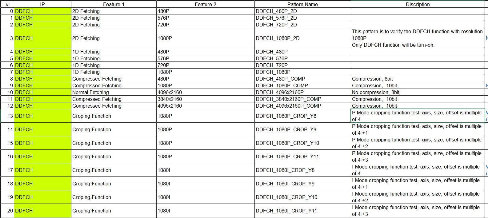
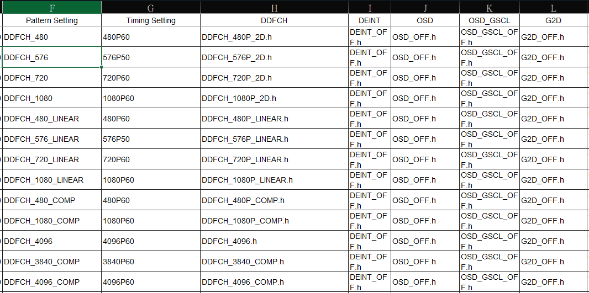
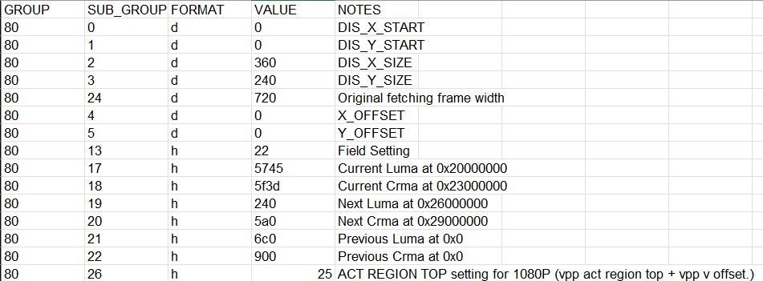

### DISPLAY Verification

* The DISPLAY Verification has a register setting generation script which writen by PERL, the verificaion pattern can be generated by an EXCEL defined table to build it. 

* TBD

